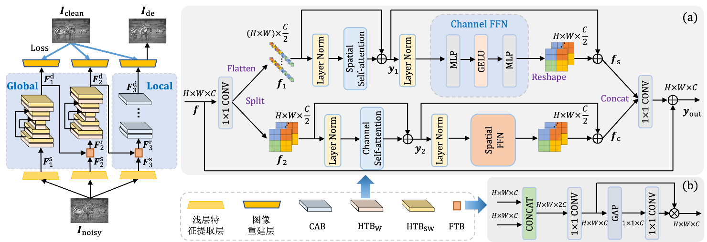
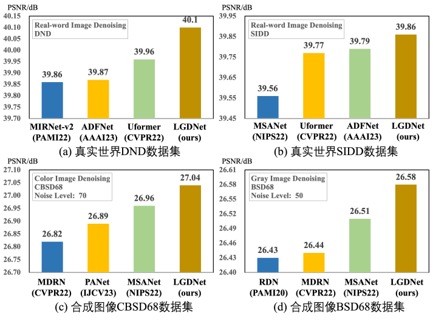
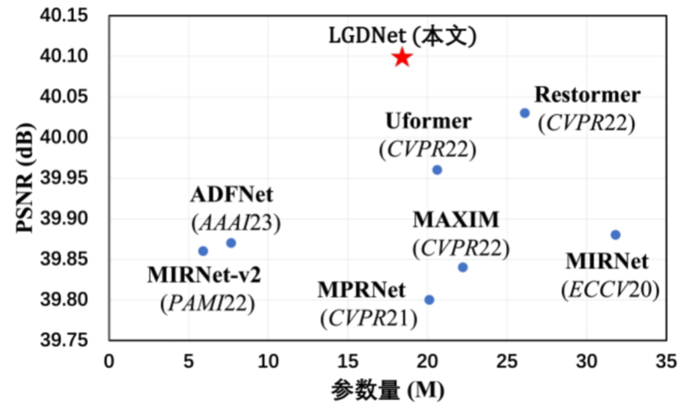

# Image denoising network based on local and global feature decoupling
This repository is for LGDNet
## Network

## Performance

### PSNR vs. Parameters

## Real world image denoising

### DND Dataset

## Synthetic image denoising

### BSD68 Dataset

### Kodak24 Dataset

The source code is coming...
